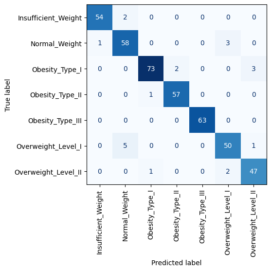

# Prediction of Obesity Risk based on Eating Habits and Physical Activity

Although it is known that excessive intake of calories can cause obesity, nutritional factors like low-quality diet, unbalanced diet, processed foods, and alcohol consumption can also increase the risk of obesity. Physical activity has also been very influential in controlling or preventing obesity. The frequency, duration, and intensity of physical activity and exercises play an essential role in the effective prevention and reduction of obesity (Gozukara et al., 2023). Eating healthy and nutritious food helps in managing proper body weight and preventing obesity. Therefore, it becomes important to invest resources in investigating the relationship of obesity with eating habits and physical activity. 
Healthcare plans can perform predictive analytics and build model to predict the early detection of obesity risk for their members, which can yield enormous benefits for both health plans and their members. Early detection of obesity risk helps individuals to be aware of the risk and take preventive measures so that they do not develop obesity related health conditions and diseases in the later stages of their life. It also helps health plans to intervene and incentivize members to motivate them in practicing obesity management such as healthy eating habits, exercises, and increased physical activity. This reduces the number of related health claims caused by obesity related diseases and essentially allows health plans to reduce the cost of care, enhance competitiveness and generate more revenue.

The main purpose of this project is to generate and evaluate models that can predict obesity risk based on eating habits and physical activity. The model must be able to generalize well to unseen data and accurately predict obesity when implemented by health plans with their live data. Additionally, the project will also focus on analyzing and understanding the relationship between obesity risk, eating habits and physical activity.

### Datasets

The dataset identified for this study is taken from UC Irvine Machine Learning Repository (UCI. 2019).  The dataset include data about eating habits, physical activity, weight, height and obesity levels of individuals from the countries of Mexico, Peru and Columbia. The data includes the eating habits and physical activity levels of 498 participants aged between 14 and 61 years.
The originally collected data was preprocessed, such as the removal of missing values, and normalization was performed. It was also balanced to reduce the skewness of the obesity levels. 23% of the source data is actual responses collected over a 30-day survey, while the remaining 77% was synthetically generated using SMOTE (Palechor & de la Hoz Manotas, 2019).

### Approach
The target variable in this study has multiple categories. Therefore, this is a multiple classification problem. A multi-model approach will be used to train different models, and then perform model evaluation to check the performance of each model. The plan is to start with simple models such as Logistic Regression and K-Nearest Neighbors, which are easy to use and comprehend. Logistic Regression is a parametric linear based model and K Nearest Neighbors is a commonly used simple non-parametric model for classification in supervised learning (Abbott, 2014, p. 254). Then move on to building further complex models such as Random Forest to get a better fit with the data.  Random forest is an ensemble method and is known to generate better accurate results than ordinary decision trees (Abbott. 2014, p. 321). Decision trees tend to be impacted by overfitting because it has a tendency to closely fit the training data (Gallatin and Albon, 2023, p. 249). Therefore, the plan is to use Random Forest over decision trees. 

### Results

Below four models were built and evaluated using accuracy, precision, recall, and F1-score metrics. The model evaluation was performed using Cross-Validation. Grid search was used to select hyperparameters for each of the models. Created a Dummy Classifier as a baseline model to compare with the trained models. It helped to check whether the trained model is better than random guessing.

- Ordinal Logistic Regression
- KNN
- Decision Trees
- Random Forest

We are using **accuracy**, **precision**, **recall**, **F1-score** to evaluate model performance. Our data does not suffer from significant _class imbalance_ in the target variable, so we can use _accuracy_ metric. However, accuracy does not capture the model's predictive power to predict the target classes correctly. Hence, we are also evaluating _precision_, _recall_, and _F1-score_. Based on the nature of the problem, it is important to correctly identify the target class in an optimistic manner, but also, at the same time have good correctness in the target class, so that the obesity management efforts and resources are directed to the right people. _Precision_ is the proportion of every observation that is predicted positive is actually positive. Models with high precision are pessimistic because they predict a class only when it is very certain. On the other hand, models with high recall are optimistic and try to predict as many true positives as possible out of all the actual positive observations. Furthermore, we are also checking the _F1-score_, which is a good measure of the balance between precision and recall. 

##### Performance Score from the Models

The above metrics comparisons show that **Random Forest** model is the best performing model with `~95%` score across all metrics. **Decision Tree** model also has similar high performance with `~954.5` score across all metrics. It is noticeable that `tree-based` models are performing better than the `nearest neighbor` and `regression` models. However, all the models has much higher performance score than the `dummy clqssifier` which demonstrate that the model preditions are not happening by chance and we can expect simlar good performance when deployed for inference.

Additionally, we are using **Confusion Matrix** to evaluate the overall performance of the selected model. A confusion matrix is a table that displays a grid of the number of observations in the actual class against the predicted class. It shows number of the correct and incorrect predictions.

### References

Abbott, Dean. (2014). Applied Predictive Analytics. Wiley.

Estimation of obesity levels based on eating habits and physical condition. (2019). UCI Machine Learning Repository. https://doi.org/10.24432/C5H31Z.

Gallatin, Kyle., Albon, Chris. (2023). Machine Learning with Python Cookbook (2nd ed.).
O’Reilly Media, Inc.

Gozukara Bag, H.G., Yagin, F.H., Gormez, Y., González, P.P., Colak, C., Gülü, M., Badicu, G., Ardigò, L.P. 
(2023). Estimation of Obesity Levels through the Proposed Predictive Approach Based on Physical Activity and Nutritional Habits. Diagnostics. 13(18), 2949. **https://doi.org/10.3390/diagnostics13182949**

Palechor, F.M., de la Hoz Manotas, A. (2019). Dataset for estimation of obesity levels based on eating habits and physical condition in individuals from Colombia, Peru and Mexico. Data Brief. 25, 104344. **https://doi.org/10.1016/j.dib.2019.104344**
